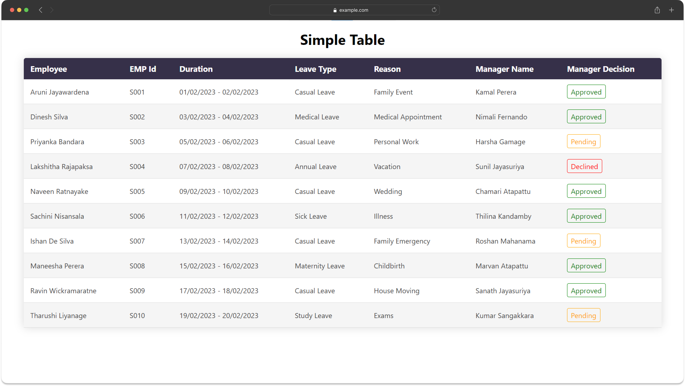
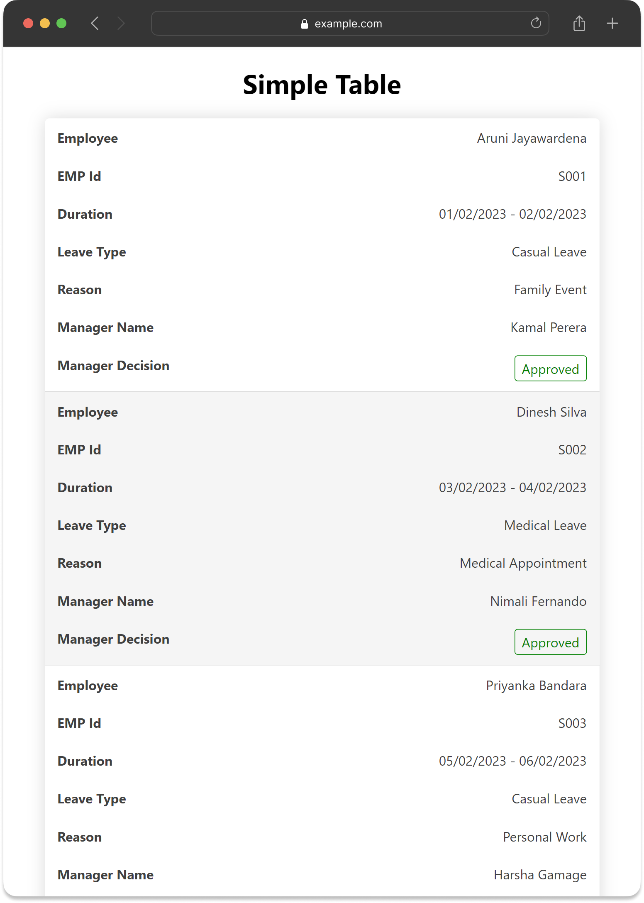

# Simple Table Component



This project showcases the implementation of a custom table component using React and TypeScript. The component is designed to display tabular data with customizable columns and cell rendering.

## Components

- **SimpleTable.tsx**: Renders the table based on provided data and column definitions.
- **Label.tsx**: Renders labels based on decision status for specific columns.

## Installation

To set up and run the project locally:

1. Clone this repository.
2. Run `npm install` to install dependencies.
3. Start the development server with `npm start`.
4. Access the application in your browser at `http://localhost:3000`.

## How to use the Component

### Component Structure

1. **`columnDefs` (Array of ColumnDef objects):**
   - Defines the characteristics of each table column.
   - Users can optionally pass a `cellRenderer` function via ColumnDef. If provided, the function will be used to create the content of the cell.

2. **`data` (Array of Record<string, object>):**
   - Contains the data to be displayed in the table.

### Sample Usage

```jsx
import React from 'react';
import SimpleTable from './components/SimpleTable';

const columnDefs = [
  { headerName: 'Column 1', field: 'column1' },
  { headerName: 'Column 2', field: 'column2', cellRenderer: (data) => <CustomComponent data={data} /> },
  // Add more column definitions as needed
];

const data = [
  { column1: 'Value 1', column2: 'Value 2' },
  // Add more data objects as needed
];

const App = () => {
  return (
    <div>
      <h1>SimpleTable Example</h1>
      <SimpleTable columnDefs={columnDefs} data={data} />
    </div>
  );
};

export default App;
```

### Responsive Design

This component is designed to be responsive for smaller screens using media queries in the CSS styles. It adjusts the table layout and cell display for better readability on devices with smaller viewports.




## Contributing

Feel free to extend the Simple Table Component or add additional features based on specific requirements.
